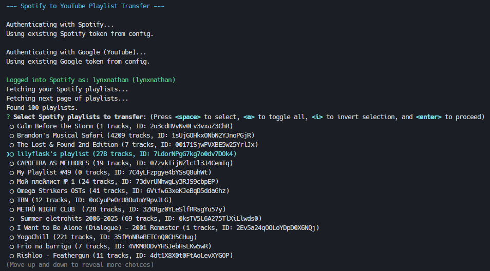

# Spotify YouTube Playlist Porter

A command-line tool (CLI) to migrate your Spotify playlists to standard YouTube video playlists. It finds corresponding tracks on YouTube using search and builds new playlists in your YouTube account.



## Features

*   **Playlist Migration:** Copies playlists from Spotify to YouTube.
*   **Search-Based Matching:** Finds YouTube videos using "Track Name + Artist Name" search (since direct ID matching isn't possible). Selects the most relevant video (usually the first from the 'Music' category).
*   **Flexible Selection:** Transfer all playlists at once, select interactively, or specify playlists by their Spotify ID.

## Prerequisites

1.  **Node.js:** Version 18 or higher recommended.
2.  **Spotify Developer Account & App:**
    *   Go to the [Spotify Developer Dashboard](https://developer.spotify.com/dashboard/).
    *   Create an app to get your **Client ID** and **Client Secret**.
    *   **Crucial:** In your app's settings, add a **Redirect URI**. By default, this tool uses `http://localhost:8888/spotify-callback`. Make sure it matches *exactly*.
3.  **Google Cloud Project & YouTube Data API v3:**
    *   Go to the [Google Cloud Console](https://console.cloud.google.com/).
    *   Create a new project (or select an existing one).
    *   Enable the **YouTube Data API v3**.
    *   Create **OAuth 2.0 Credentials** (for a "Web application"). Note your **Client ID** and **Client Secret**.
    *   **Crucial:** Under "Authorized redirect URIs" for your OAuth credentials, add the URI the tool will use. By default: `http://localhost:8888/youtube-callback`. Make sure it matches *exactly*.

## Configure & run

Before the first run, you need to configure the tool with your API credentials obtained in the Prerequisites step.

Run the configuration command:

```bash
npx spotify-youtube-playlist-porter@latest configure
```

You will be prompted to enter:

*   Spotify Client ID
*   Spotify Client Secret
*   Spotify Redirect URI (defaults to `http://localhost:8888/spotify-callback`)
*   Google Client ID
*   Google Client Secret
*   Google Redirect URI (defaults to `http://localhost:8888/youtube-callback`)
*   Callback Port (defaults to `8888`)

**🔒 Security Note:** Your API credentials (including secrets) and authentication tokens will be stored locally in a configuration file managed by `conf`. The exact location depends on your operating system (you can see the path when you run `configure`). Protect this file appropriately. Use the `reset-all` command if you need to clear everything.

## Usage 

Once configured, you can start transferring playlists.

**1. Authenticate (First Run):**
The first time you run a transfer command, the tool will:
*   Open your browser to ask for Spotify authorization. Log in and grant permission.
*   Open your browser again to ask for Google (YouTube) authorization. Log in and grant permission.
Tokens will be saved for future use.

**2. Run Transfer Commands:**

*   **Interactive Selection:** (Default action if no flags are given)
    ```bash
    npx spotify-youtube-playlist-porter@latest transfer
    ```
    This will list your Spotify playlists, allowing you to choose which ones to transfer using checkboxes.

*   **Transfer All Playlists:**
    ```bash
    npx spotify-youtube-playlist-porter@latest transfer --all
    ```

*   **Transfer Specific Playlists by ID:**
    (Find the Spotify Playlist ID from its URL: `open.spotify.com/playlist/<ID>`)
    ```bash
    npx spotify-youtube-playlist-porter@latest --playlist <spotify_playlist_id_1> <spotify_playlist_id_2>
    ```

**3. Other Commands:**

*   **Re-run Configuration:**
    ```bash
    npx spotify-youtube-playlist-porter@latest configure
    ```

*   **Clear Authentication Tokens:** (Forces re-authentication on next run)
    ```bash
    npx spotify-youtube-playlist-porter@latest reset-auth
    ```

*   **Clear ALL Configuration & Tokens:** (Requires running `configure` again)
    ```bash
    npx spotify-youtube-playlist-porter@latest reset-all
    ```

## Development Setup

1.  **Clone the repository:**
    ```bash
    git clone https://github.com/yourusername/spotify-youtube-playlist-porter.git
    cd spotify-youtube-playlist-porter
    ```

2.  **Install dependencies:**
    ```bash
    npm install
    ```

3.  **Build (Optional but good practice):**
    Compiles TypeScript to JavaScript in the `dist/` folder. Required for the final package.
    ```bash
    npm run build
    ```

4.  **Run TypeScript directly using `ts-node`:**
    Use the `dev` script. Pass arguments after `--`.
    ```bash
    # Run configure command
    npm run dev -- configure

    # Run transfer command interactively
    npm run dev

    # Run transfer command for all playlists
    npm run dev -- --all

    # Run transfer command for specific playlist
    npm run dev -- --playlist <your_playlist_id>
    ```

5.  **Debugging (VS Code):**
    *   A `launch.json` file is included for easy debugging.
    *   Edit the `args` array within `.vscode/launch.json` to specify the command/options you want to debug.
    *   Set breakpoints in your `.ts` files.
    *   Go to the "Run and Debug" panel, select "Debug CLI (ts-node)", and press F5.

## TODO / Roadmap

Here are some areas for potential improvement:

*   [ ] **Rate Limiting:** Implement proper exponential backoff instead of a fixed delay for API calls. Make delay configurable.
*   [ ] **Error Handling:**
    *   Provide more specific feedback on failures (e.g., distinguish API errors, playlist not found, video adding errors).
    *   Summarize failed tracks by name at the end of a playlist transfer.
    *   Improve callback server robustness (e.g., add timeouts).
*   [ ] **Search Accuracy:**
    *   Implement more sophisticated logic to select the best YouTube video match (e.g., prioritize "Official Audio/Video", check channel names like "Topic" or "VEVO", consider video duration).
    *   Offer an interactive prompt if multiple good candidates are found?
    *   Investigate using ISRC (if available from Spotify) with YouTube search, although API support seems limited.
*   [ ] **User Experience:**
    *   Add progress bars for track fetching and transfer steps.
    *   Implement a `--verbose` flag for more detailed logging.
    *   Add confirmation prompts, especially before transferring `--all` playlists.
    *   Add an option to set YouTube playlist privacy (`public`, `unlisted`, `private`).
    *   Option to add a prefix/suffix to created YouTube playlist names.
*   [ ] **Features:**
    *   Option to *update* an existing YouTube playlist (match by name?) instead of always creating a new one.
    *   Ability to transfer "Liked Songs" from Spotify (requires `user-library-read` scope).
*   [ ] **Code Quality & Testing:**
    *   Refactor OAuth callback server logic into a more isolated helper/module.
    *   Add unit and integration tests.

## License

This project is licensed under the MIT License. See the [LICENSE](LICENSE) file for details.